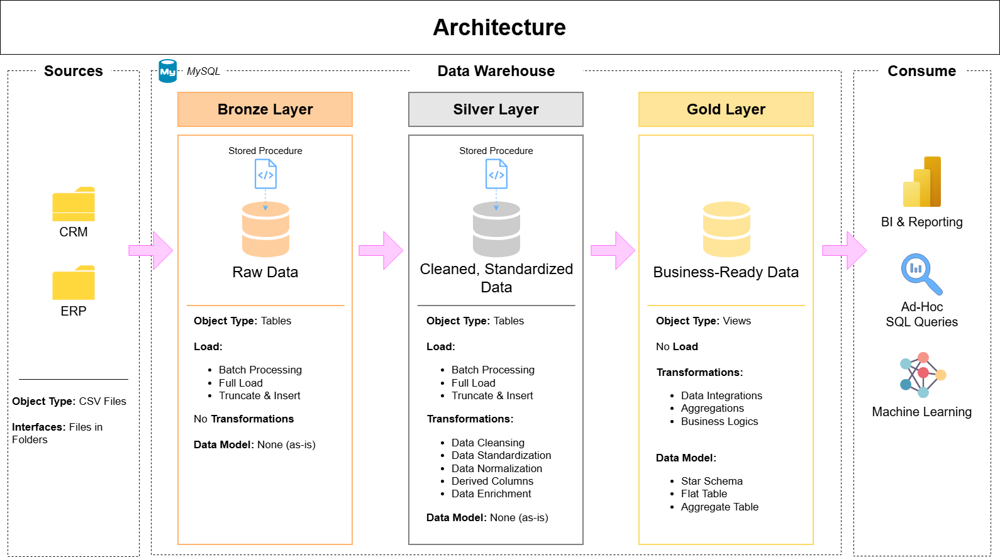

# 📊 Data Warehouse and Analytics Project
Welcome to the **Data Warehouse and Analytics Project** repository!  
歡迎來到我的**資料倉儲與分析專案**！

This project demonstrates a comprehensive data warehousing and analytics solution, from building a data warehouse to generating actionable insights. Designed as a portfolio project, it highlights industry best practices in data engineering and analytics.  
本專案展示了一套完整的資料倉儲與分析解決方案，涵蓋從資料倉儲建置到從資料中挖掘有價值的分析結果的完整流程。作為一個作品集專案，它展現了資料工程與資料分析領域中的業界最佳實務與標準流程。

---
## 🚀 Project Overview（專案概述）

This project involves  
本專案包含以下內容：

1. **Data Architecture**: Designing a Modern Data Warehouse Using Medallion Architecture **Bronze**, **Silver**, and **Gold** layers.  
   **資料架構設計**：採用現代化資料倉儲設計，使用獎章式架構，分為分為銅層、銀層與金層三個層級。
2. **ETL Pipelines**: Extracting, transforming, and loading data from source systems into the warehouse.  
   **ETL 流程**：負責從來源系統中擷取、轉換並載入資料至資料倉儲。
3. **Data Modeling**: Developing fact and dimension tables optimized for analytical queries.  
   **資料建模**：建立事實表與維度表，以優化查詢效能並支援分析需求。
4. **Analytics & Reporting**: Creating SQL-based reports and dashboards for actionable insights.  
   **資料分析與報表**：使用 SQL 建立報表與儀表板，提供可支援決策的分析結果。

---
## 🏗️ Data Architecture（資料架構）

The data architecture for this project follows Medallion Architecture **Bronze**, **Silver**, and **Gold** layers  
本專案的資料架構採用獎章式架構，並分為銅層、銀層與金層三個層級：

1. **Bronze Layer**: Stores raw data as-is from the source systems. Data is ingested from CSV Files into SQL Server Database.  
   **銅層**：儲存來自來源系統的原始資料，不進行任何修改。資料會從 CSV 檔案匯入至 SQL Server 資料庫中。
2. **Silver Layer**: This layer includes data cleansing, standardization, and normalization processes to prepare data for analysis.  
   **銀層**：負責資料清理、標準化與正規化等處理流程，提升資料品質，並為後續分析做好準備。
3. **Gold Layer**: Houses business-ready data modeled into a star schema required for reporting and analytics.  
   **金層**：儲存可直接用於商業分析與報表製作的資料，並依照星型模型（Star Schema）進行建模，以支援分析與決策需求。

---
## 📜 License（授權）

This project is licensed under the [MIT License](LICENSE) and is intended for learning and reference purposes. You are free to use, modify, and share this project, provided that proper attribution to the original author is retained.  
本專案採用 [MIT 授權條款](LICENSE)，供學習與參考使用。你可以自由使用、修改與分享本專案內容，但需保留適當的原始作者標註。

---
## ⭐ About Me（關於我）

Hi, I’m James, a computer programming student with a strong interest in data engineering and data analytics. I enjoy building end-to-end data solutions, from data processing and data warehousing to turning data into meaningful insights for decision-making.  
Hi, 我是 James，一名主修程式設計的學生，對資料工程與資料分析領域有濃厚興趣。我喜歡打造端到端的資料解決方案，從資料處理與資料倉儲，到將資料轉化為有價值的決策資訊。

I am currently focused on improving my skills in SQL, Python, and database systems, and I am actively seeking opportunities as a Junior Data Engineer / Entry-level Data Engineer to gain hands-on industry experience and continue growing professionally.  
目前我專注於提升 SQL、Python 以及資料庫系統相關技能，並積極尋找 Junior Data Engineer / Entry-level Data Engineer 的機會，希望能在實務環境中累積經驗並持續成長。
